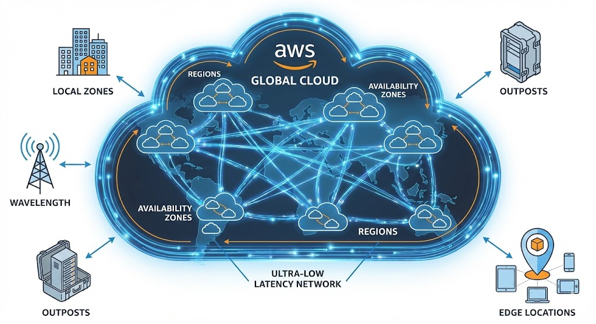

# AWS Global Infrastructure

## Definitions

Foundational environment that powers all Amazon Web Services worldwide.

Three primary components:
- Regions
- Availability Zones (AZs)
- Extensive global network that interconnects them

Specialized locations like Edge Locations, Local Zones, Wavelength Zones, and Outposts to address unique latency and residency needs.

## Core Components

### AWS Regions

A Region is a physical, geographically separated location around the world where AWS clusters its data centers.

#### Characteristics

**Isolation and Resilience**
- Independent and isolated from all other Regions → prevent correlated failures.

**Data Sovereignty**
- Independently stored and processed → meet compliance and data residency requirements.

**Availability**
- 3 HA zones

**Interconnectivity**
- Interconnected by the AWS global private backbone network → better coordination with others.

### Availability Zones (AZs)

**Physical Design**
- Separate and redundant power infrastructure, cooling systems, and physical security.

**Network Connectivity**
- Interconnected with typically single-digit millisecond latency between them → allows support synchronous data replication.

**Fault Tolerance**
- Providing greater fault tolerance and increasing resilience against issues like power outages, network downtime, or natural disasters.

## Edge and Hybrid Infrastructure

### Edge Locations

- Functioning as Points of Presence (PoPs) → closer to user.
- [Route 53 Resolver](./AWS_Route_53_Resolver.md) → CloudFront Cache + Lambda@Edge code execution

### Regional Edge Caches

- Intermediary caching layers situated between Edge Locations and the origin server.
- They have larger capacity than Edge Locations and store content that is less frequently requested but was evicted from smaller caches.
- Work with CloudFront to further minimize trips back to the origin server, improving performance, especially for larger or less popular files.

### AWS Local Zones

- Extensions of an AWS Region deployed closer to large population or industrial centers, offering select services (compute, storage, database).
- Designed for ultra-low latency access (single-digit millisecond latency) for applications like real-time gaming, live streaming, and media rendering.
- They connect seamlessly to the parent Region for access to the full range of in-region services using familiar AWS APIs.

### AWS Wavelength Zones

- Integrations placed within 5G network data centers operated by telecommunications providers at the edge of the 5G network.
- Deliver ultra-low latency (single-digit ms) for mobile applications.
- They embed core services (EC2, EBS, VPC) within the carrier's network, ensuring application traffic from 5G devices remains inside the telecommunications network.

### AWS Outposts

- AWS infrastructure racks or servers deployed in a customer's on-premises facility, extending AWS APIs, tools, and services locally.
- Supports hybrid cloud applications, Industrial IoT, and compliance needs requiring sub-millisecond latency or local data residency.
- Services like EC2, EBS, and RDS can run locally, managed using the same AWS APIs as the cloud.

## Contribution to Other AWS Services

### Resilience and Disaster Recovery (DR)

**Elastic Disaster Recovery (DRS)**
- DRS utilizes the regional infrastructure to replicate data from source servers (on-premises or cloud) into a staging area within a selected AWS Region.
- This enables disaster recovery strategies such as cross-Region or cross-Availability Zone recovery (AZ).

**Database Services**
- Services like Amazon RDS use multiple AZs to achieve high availability (Multi-AZ deployments) by synchronously replicating data to a standby instance in a separate AZ, enabling automatic failover.

**DR Strategies**
- The infrastructure supports various DR strategies ranging from Backup and Restore (lowest cost, RTO/RPO in hours) to Pilot Light (RTO/RPO in 10s of minutes) and Warm Standby (RTO/RPO in minutes), and finally, Multi-site Active/Active (real-time RPO/RTO).

### Connectivity and Networking

**Amazon Virtual Private Cloud (VPC)**
- The fundamental networking service allows launching resources in isolated networks.
- The VPC architecture spans AZs using subnets.

**Transit Gateway**
- Acts as a network transit hub for interconnecting VPCs across the AWS Global Infrastructure, simplifying routing and handling connectivity among thousands of VPCs in a hub-and-spoke model.

**VPC Peering**
- Networking connection enables routing traffic directly between two VPCs (even across Regions or accounts) using private IP addresses.
- Leverages the AWS private backbone for encrypted inter-Region traffic that bypasses the public internet.

**Hybrid Connectivity**
- On-premises networks can connect securely to AWS VPCs using AWS Direct Connect (dedicated private network connection) or Site-to-Site VPN (encrypted tunnels over the internet).

### Content and Traffic Delivery

**AWS Global Accelerator**
- Utilizes the extensive AWS edge network and static IP addresses to direct internet traffic onto the highly available AWS global network backbone.
- Improves application availability and performance for global users.

**Amazon CloudFront**
- Uses Edge Locations for caching and accelerating delivery of web content globally.

**Amazon Route 53**
- Scalable DNS service that routes users to internet applications running on AWS.
- Utilizes health checks and routing policies to ensure traffic goes to the nearest or healthiest endpoint in the infrastructure.
- See [Route 53 Resolver (VPC Resolver)](./AWS_Route_53_Resolver.md) for DNS resolution within VPCs and hybrid DNS connectivity.

### Security and Governance

**AWS Key Management Service (KMS)**
- The service for creating and managing cryptographic keys.
- Although KMS typically runs in a Region, it can be integrated to encrypt data stored in volumes/buckets residing in Local Zones or Outposts.

**AWS CloudTrail**
- Records AWS API calls across the entire infrastructure for governance, compliance, and auditing of activity.
- An organization trail created via CloudTrail logs events across all accounts in an AWS Organization, centralizing monitoring.

**AWS Organizations**
- Provides the framework to centrally manage and govern the multi-account environment across all Regions.
- Enables implementing permissions guardrails like Service Control Policies (SCPs) and Resource Control Policies (RCPs) across OUs and accounts.

